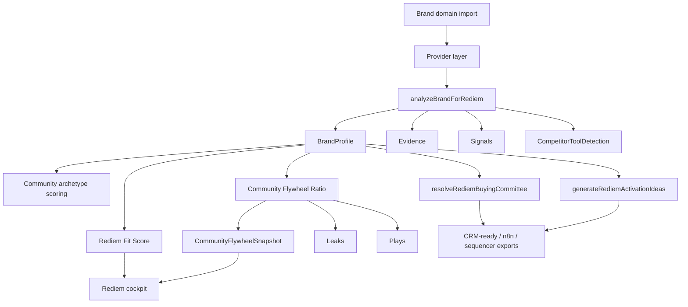

# Architecture

Rediem GTM Intelligence is a Rediem-specific GTM intelligence and outbound orchestration engine. It finds community-driven consumer brands, identifies where customer participation is fragmented, estimates Community Flywheel Ratio, recommends Rediem plays, and prepares evidence-backed data for CRM-ready export shapes, n8n, spreadsheets, and sequencer review.

The product path is Rediem-first. Generic B2B enrichment modules are legacy internals and are not the main application surface.

## System Flow



## Stack

- TypeScript
- Next.js App Router
- Postgres
- Prisma ORM
- Provider adapter interfaces
- Evidence-first normalization
- Safe formula parser/evaluator for Rediem templates
- CSV import/export
- In-process workflows today, with queue interfaces ready for Redis-backed workers

## Rediem Core Modules

```text
src/server/workflows/analyzeBrandForRediem.ts
src/server/workflows/resolveRediemBuyingCommittee.ts
src/server/workflows/generateRediemActivationIdeas.ts
src/server/scoring/rediem.ts
src/server/scoring/communityArchetypes.ts
src/server/scoring/communityFlywheel.ts
src/server/scoring/rediemTitleTaxonomy.ts
src/server/rediem/uiData.ts
src/server/exports/
src/server/crm/       CRM-ready export shape and dry-run mappings
```

## Data Model

Core Rediem models:

- `BrandProfile`: Rediem-specific profile for commerce stack, category, subscription, loyalty, reviews, UGC/social, retail, mission, sustainability, loyalty maturity, and score fields.
- `CompetitorToolDetection`: detected loyalty, review, subscription, referral, email, SMS, and commerce tooling.
- `BrandActivationIdea`: evidence-backed Rediem activation ideas such as review reward series, referral challenge, receipt upload challenge, VIP migration, and zero-party preference challenge.
- `BrandScoreHistory`: score snapshots for Rediem fit and component scores.
- `CommunityFlywheelSnapshot`: CFR estimate, confidence, tier, earned/subsidized inputs, primary leak, secondary leak, and recommended play.
- `CommunityFlywheelLeak`: diagnosed leaks such as points-only loyalty, reviews isolated from rewards, retail not connected to DTC, or no zero-party data loop.
- `CommunityFlywheelPlay`: recommended Rediem plays with expected CFR impact and confidence.
- `Evidence`: field-level provenance for every enriched claim.

Shared platform models:

- `Workspace`
- `Account`
- `Person`
- `Signal`
- `WorkflowRun`
- `ProviderResult`
- `FormulaColumn`
- `FormulaResult`
- `CacheEntry`

## Scoring Model

Rediem Fit Score is not centered on Shopify, revenue, or headcount. Those are filters. The primary score is weighted around participation potential:

- Community Energy: 25%
- Participation Capture Gap: 20%
- Repeat Purchase / Ritual Fit: 15%
- Retail-to-Owned Data Opportunity: 15%
- Mission / Identity Strength: 10%
- Stack / Migration Opportunity: 10%
- Timing Signal: 5%

Community archetypes:

- `CULT_CONSUMER_BRAND`
- `MISSION_LED_BRAND`
- `RITUAL_REPEAT_USE_BRAND`
- `RETAIL_TO_DTC_BRIDGE_BRAND`
- `CREATOR_AMBASSADOR_LED_BRAND`
- `PRODUCT_DROP_BRAND`
- `EDUCATION_TRUST_LED_BRAND`
- `LOW_COMMUNITY_COMMODITY_BRAND`

## Evidence Model

Every claim should preserve:

- `value`
- `sourceUrl`
- `provider`
- `confidence`
- `capturedAt`
- `rawExcerpt` when available

Unknown or invisible fields must remain unknown, null, false, or low-confidence depending on the field. The system should not invent loyalty programs, customer counts, revenue, conversion rates, or social metrics.

## Provider Layer

Application logic depends on provider interfaces rather than specific vendors. Current provider categories:

- Web research
- Company enrichment
- People discovery
- Contact enrichment
- Email verification
- Browser/style inspection

Local tests use mock providers. Live providers should be configured through environment variables and logged through `ProviderResult` with redaction.

Current status: mock/demo providers work now. Live provider adapters are follow-up work and require API keys plus provider-specific implementation.

## CRM And Orchestration

The repository currently supports CRM-ready export shapes and dry-run mappings. Live HubSpot/Salesforce mutation flows are intentionally follow-up work.

The n8n and sequencer docs describe payload contracts for:

- HubSpot company/contact field mapping after review
- Smartlead/Instantly handoff for verified-email-only contacts
- Google Sheets/Airtable review queues
- CRM custom fields for Rediem fit, CFR, flywheel leak, recommended play, buyer persona, and source URLs

## Legacy Modules

The following generic B2B modules remain only to avoid destabilizing earlier tests and support utilities:

- `src/server/workflows/researchAccount.ts`
- `src/server/workflows/resolveBuyingCommittee.ts`
- `src/server/workflows/outreachAngles.ts`
- `src/server/scoring/titleTaxonomy.ts`
- `src/server/playbooks/examples.ts`

They are de-prioritized and should not be extended for Rediem work. Rediem workflows should use the Rediem modules listed above.

## Deployment Notes

- Run Postgres-backed migrations before using real data.
- Keep live provider credentials in `.env`, not code.
- Prefer mock providers for local tests and CI.
- Treat CFR as a confidence-scored estimate during prospecting.
- Keep outbound exports verified-email-only.
