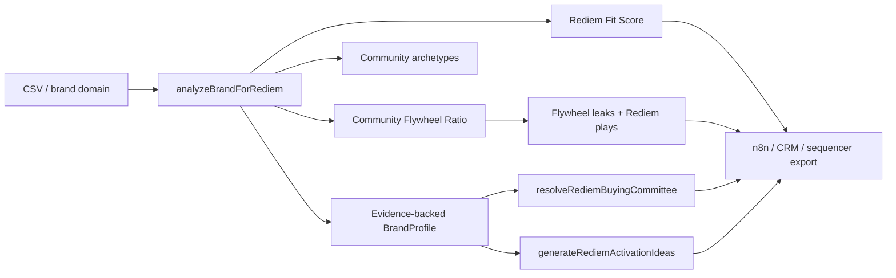

# Rediem GTM Intelligence

A Rediem-specific GTM intelligence layer, community flywheel diagnostic, and outbound orchestration engine for identifying community-driven consumer brands and turning latent customer participation into measurable growth loops.

This repo is built for Rediem's actual ICP: consumer brands where customers already review, refer, subscribe, share, buy in retail, follow culturally, or participate socially, but where that participation is fragmented across social, loyalty, reviews, subscriptions, SMS, retail, referrals, and paid acquisition.

It is not positioned as a generic enrichment clone. The primary product path is Rediem brand analysis, Rediem fit scoring, Community Flywheel Ratio, activation ideas, buyer angles, and n8n/CRM-ready account intelligence.

## What It Does

- Identifies community-driven consumer brands with high participation potential.
- Diagnoses loyalty, community, retail-to-owned-data, subscription, reviews, UGC, and referral gaps.
- Classifies community archetypes such as cult consumer brand, mission-led brand, ritual repeat-use brand, retail-to-DTC bridge brand, creator/ambassador-led brand, and product-drop brand.
- Scores Rediem fit around community energy, participation capture gap, ritual repeat-purchase fit, retail-to-owned-data opportunity, mission identity, stack migration opportunity, and timing.
- Estimates Community Flywheel Ratio, or CFR.
- Defines Rediem-native GTM diagnostics for participation capture, retail-to-community bridge, mission-to-action, UGC verification, discount dependence, zero-party data depth, product drops, stack fragmentation, and owned community conversion.
- Detects flywheel leaks and recommends Rediem-specific plays.
- Generates activation ideas and buyer angles for Rediem AEs.
- Resolves Rediem buyer personas across ecommerce, retention, lifecycle, loyalty, community, CRM, CMO, founder, and technical integration stakeholders.
- Produces n8n-ready workflow outputs and CRM-ready account intelligence for HubSpot, Google Sheets, Airtable, Smartlead, and Instantly.

## Why Rediem-Specific

Rediem sells community-driven loyalty and brand participation infrastructure. The useful GTM question is not just whether a company uses Shopify, has a certain revenue band, or has a certain team size. Those are filters.

The core question is:

> Does this brand already have customer participation that Rediem can capture, connect, and turn into a repeatable growth loop?

The engine prioritizes evidence of:

- Customer reviews and review tools
- Referrals, affiliates, ambassadors, creators, and UGC
- Subscriptions, replenishment, rituals, and repeat-use language
- Retail presence, marketplaces, and receipt-to-owned-data opportunities
- Loyalty, rewards, VIP, points, and referral pages
- SMS, email, subscription, review, loyalty, and retail data fragmentation
- Mission, sustainability, wellness, science, clean ingredients, education, or identity hooks

## Community Flywheel Ratio

Community Flywheel Ratio is Rediem's north-star diagnostic:

```text
CFR = Earned Community Growth / Subsidized Transactional Growth
```

Plain English: CFR estimates how much growth a brand creates from verified customer participation compared with how much growth it has to buy through discounts, points, paid acquisition, and one-off incentives.

Prospecting CFR is conservative and confidence-scored. The system does not fabricate exact customer metrics from public data.

CFR tiers:

- `< 0.5`: Transactional Trap
- `0.5 to < 1.0`: Emerging Community Loop
- `1.0 to < 2.0`: Healthy Community Flywheel
- `>= 2.0`: Iconic Brand Flywheel

## Architecture



Primary Rediem modules:

- `src/server/workflows/analyzeBrandForRediem.ts`
- `src/server/scoring/rediem.ts`
- `src/server/scoring/communityArchetypes.ts`
- `src/server/scoring/communityFlywheel.ts`
- `src/server/workflows/resolveRediemBuyingCommittee.ts`
- `src/server/workflows/generateRediemActivationIdeas.ts`
- `src/server/rediem/uiData.ts`
- `src/server/exports/`
- `src/server/crm/`

Legacy generic modules are documented in [LEGACY_MODULES.md](/LEGACY_MODULES.md) and should not be extended for Rediem work.

## Demo

<!-- Screenshot placeholder:

Place the screenshot at docs/assets/rediem-cockpit.png, then remove this comment.
-->

See [docs/DEMO.md](/docs/DEMO.md) and [examples/sample-rediem-dossier.json](/examples/sample-rediem-dossier.json).

Run a mocked local brand analysis:

```bash
npm run workflow:rediem-brand -- --domain sample-beverage.test
npm run workflow:rediem-brand -- --domain sample-beverage.test --output examples/sample-run-output.json
```

The demo output shape includes:

- `brandProfile`
- `communityArchetypes`
- `rediemScores`
- `communityFlywheelRatio`
- `flywheelLeaks`
- `activationIdeas`
- `buyerCommittee`
- `recommendedFirstContact`
- `outboundAngles`
- `n8nExport`
- `crmFields`
- `evidence`

## Quickstart

```bash
npm install
cp .env.example .env
npm run db:generate
npm run dev
```

Open:

```text
http://localhost:3000/rediem/accounts
```

For database-backed pages and seed data:

```bash
npm run db:migrate
npm run db:seed
```

## Environment

See [ENVIRONMENT.md](/ENVIRONMENT.md).

Local mock mode:

```bash
DATABASE_URL=
GTM_ENGINE_RESEARCH_PROVIDER=mock
MCP_RESEARCH_MOCK_RESPONSES=true
```

Live provider keys are optional. Provider adapters are still follow-up work unless explicitly implemented.

## Commands

```bash
npm run dev
npm run build
npm run lint
npm test
npm run eval
npm run workflow:rediem-brand -- --domain example.com
npm run crm:dry-run
```

## n8n And CRM Outputs

The export shape is designed to feed:

- n8n webhook and HTTP Request nodes
- HubSpot company/contact creation through reviewed dry-run mappings
- Smartlead or Instantly sequence handoff
- Google Sheets or Airtable review queues
- CRM custom fields for Rediem fit, CFR tier, primary flywheel leak, recommended play, buyer persona, and evidence URLs

See [docs/N8N_WORKFLOW.md](/docs/N8N_WORKFLOW.md).

## Docs

- [ARCHITECTURE.md](/ARCHITECTURE.md)
- [GTM_PLAYBOOK.md](/GTM_PLAYBOOK.md)
- [COMMUNITY_FLYWHEEL_RATIO.md](/COMMUNITY_FLYWHEEL_RATIO.md)
- [docs/GTM_DIAGNOSTIC_METRICS.md](/docs/GTM_DIAGNOSTIC_METRICS.md)
- [docs/PLAYBOOK_AS_CODE.md](/docs/PLAYBOOK_AS_CODE.md)
- [docs/DEMO.md](/docs/DEMO.md)
- [docs/N8N_WORKFLOW.md](/docs/N8N_WORKFLOW.md)
- [docs/ROADMAP.md](/docs/ROADMAP.md)
- [ENVIRONMENT.md](/ENVIRONMENT.md)
- [SECURITY.md](/SECURITY.md)
- [KNOWN_LIMITATIONS.md](/KNOWN_LIMITATIONS.md)

Archived generic implementation notes are in `docs/archive/`.

## Current Status

Implemented:

- Rediem brand analysis with mocked providers
- Rediem fit scoring
- Community archetype scoring
- CFR scoring, leak detection, and recommended plays
- Rediem activation ideas
- Rediem buyer committee scoring
- CSV import/export primitives
- CRM-ready export shape and dry-run mappings
- n8n/CRM export shape documentation

Still follow-up:

- Live web and people provider adapters
- Brand discovery queue
- Live HubSpot/Salesforce field sync
- n8n webhook templates
- CFR and archetype UI panels
- Production auth and workspace access controls
- npm audit remediation

## Evidence And Safety

- Do not fabricate invisible or unknown fields.
- Preserve source URL, provider, confidence, capturedAt, and raw excerpt whenever available.
- Treat public-prospect CFR as an estimate, not an exact customer metric.
- Do not mark an account outbound-ready unless contact safety rules pass.
- Do not store secrets in logs or fixtures.

No substantial third-party source code is copied into this repository. A third-party notices file is not needed unless future changes vendor external source code.
