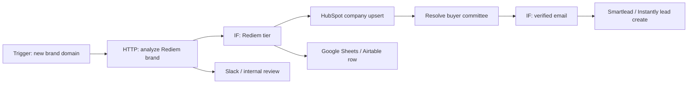

# n8n Workflows

Rediem GTM Intelligence should export clean, evidence-backed payloads that can be routed through n8n into CRM, spreadsheets, and sequencer tools.

The repo does not require n8n to run locally. This document describes the recommended integration contract.

## Recommended n8n Flow



## Payload Shape

Recommended account payload:

```json
{
  "workspaceId": "workspace_123",
  "accountId": "account_123",
  "domain": "example-brand.com",
  "brand": "Example Brand",
  "rediemFitScore": 87,
  "rediemTier": "Tier 1",
  "communityArchetypes": [
    "CULT_CONSUMER_BRAND",
    "RITUAL_REPEAT_USE_BRAND"
  ],
  "communityEnergy": 91,
  "participationCaptureGap": 82,
  "loyaltyMaturityLevel": 2,
  "estimatedCfr": 0.82,
  "cfrTier": "Emerging Community Loop",
  "primaryLeak": "POINTS_ONLY_LOYALTY",
  "recommendedPlay": "VIP_TIER_MIGRATION",
  "activationIdea": "Move VIP points into review, referral, and creator challenges.",
  "sourceUrls": [
    "https://example-brand.com/rewards",
    "https://example-brand.com/reviews"
  ]
}
```

Recommended contact payload:

```json
{
  "accountId": "account_123",
  "fullName": "Maya Chen",
  "title": "Director of Retention",
  "personaGroup": "operatorBuyer",
  "roleScore": 88,
  "email": "maya@example-brand.com",
  "emailStatus": "VERIFIED",
  "contactabilityScore": 92,
  "suggestedAngle": "Your reviews and VIP program show participation that is not yet connected to referrals or lifecycle incentives."
}
```

## HubSpot

Suggested company custom fields:

- `rediem_fit_score`
- `rediem_tier`
- `community_archetypes`
- `community_energy_score`
- `participation_capture_gap`
- `loyalty_maturity_level`
- `estimated_cfr`
- `cfr_tier`
- `primary_flywheel_leak`
- `recommended_rediem_play`
- `rediem_source_urls`

Suggested contact custom fields:

- `rediem_persona_group`
- `rediem_role_score`
- `rediem_contactability_score`
- `rediem_email_status`
- `rediem_suggested_angle`

Use dry-run mode before writing to CRM. Default overwrite policy should be blank-only.

## Smartlead / Instantly

Only send contacts when:

- `emailStatus` is `VERIFIED`
- `contactabilityScore` meets the configured threshold
- The suggested angle has supporting evidence
- Suppression rules have passed

Recommended custom variables:

- `brand_name`
- `rediem_tier`
- `community_archetype`
- `primary_leak`
- `recommended_play`
- `activation_idea`
- `source_url_1`
- `source_url_2`

## Google Sheets / Airtable

Use these as review queues before CRM/sequencer writes:

- One row per account for AE prioritization.
- One row per buyer/contact for sequencing review.
- Evidence URLs in separate columns so reps can inspect claims.
- CFR confidence and Rediem fit confidence visible near the top.

## Error Handling

n8n workflows should:

- Stop or route to manual review when confidence is low.
- Avoid sequencer actions for unverified emails.
- Preserve source URLs.
- Log provider errors and workflow run IDs.
- Keep API tokens in n8n credentials, not in payloads or logs.
